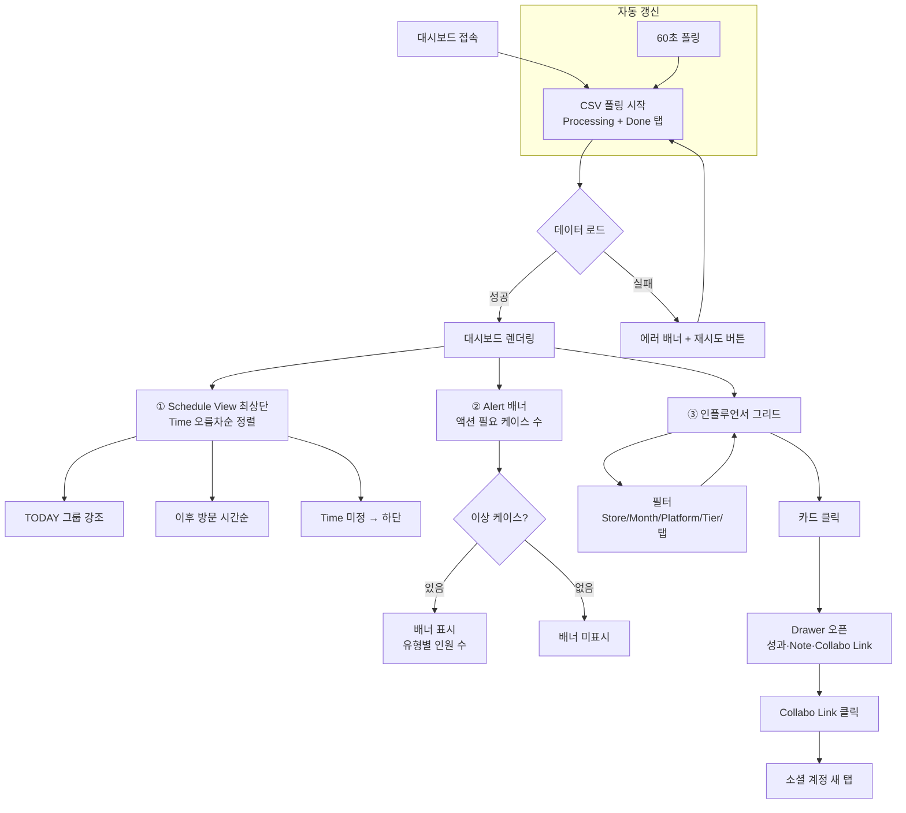

# BeautyMaster Influencer Dashboard — UX Flow

> v3 — 2026-07-01 수정: 데스크탑 2컬럼 레이아웃 확정 (좌측 Schedule 고정 + 우측 그리드)

---

## 유저 시나리오

### 시나리오 1: 오늘 누가 오는지 확인한다 (핵심)

- **사용자**: 그랜드 오프닝 운영 담당자
- **목표**: 오늘 방문 예정 인플루언서를 방문 시간 순서로 빠르게 파악
- **플로우**:
  1. 대시보드 접속 → 자동으로 구글시트 CSV 폴링 시작
  2. 페이지 최상단 Schedule View에서 오늘 방문 예정 목록 즉시 확인 (Time 오름차순 정렬)
  3. 각 행에서 이름 · 방문 시각 · 4단계 상태를 한눈에 확인
  4. 이름 클릭 → 상세 Drawer 열어 소셜 계정 · Note 확인
- **성공 조건**: 스크롤 없이 오늘 방문 순서를 3초 이내 파악
- **예외 상황**: Time 컬럼이 비어 있으면 "시간 미정"으로 표시, 목록 하단 배치

---

### 시나리오 2: 지금 조치가 필요한 케이스를 처리한다

- **사용자**: 운영 담당자
- **목표**: 방문했는데 콘텐츠 안 올린 인플루언서 등 즉시 액션이 필요한 케이스 식별
- **플로우**:
  1. Schedule View 바로 아래 Alert 배너에서 액션 필요 인원 수 확인
  2. 배너 클릭 또는 아래로 스크롤 → Alert 목록에서 인플루언서별 요구 액션 확인
  3. 해당 인플루언서 행 클릭 → Drawer에서 Note 이력 파악
  4. 구글시트에서 직접 조치 후 대시보드 자동 갱신 확인
- **성공 조건**: "지금 내가 뭘 해야 하는가"가 배너만 봐도 즉시 파악
- **예외 상황**: 이상 케이스 없으면 Alert 배너 미표시 (공간 차지 안 함)

---

### 시나리오 3: 전체 운영 현황을 한 줄로 점검한다

- **사용자**: 운영 담당자
- **목표**: 이번 그랜드 오프닝 전체 단계별 진행 수를 빠르게 파악
- **플로우**:
  1. 헤더 KPI 한 줄에서 총원 · 동의 · 방문 · 업로드 · 크레딧 완료 수 즉시 확인
  2. 필터(Store / Month / Platform / Tier)로 특정 그룹만 좁혀 보기
  3. 인플루언서 그리드에서 개별 상태 카드 확인
- **성공 조건**: 페이지 상단만 봐도 전체 진행률 파악 가능, 별도 퍼널 섹션 불필요
- **예외 상황**: 데이터 없을 때 Skeleton 상태 표시

---

### 시나리오 4: 콘텐츠 성과를 평가한다

- **사용자**: 운영 담당자 (업로드 후 한 달 경과 시점)
- **목표**: 콘텐츠 올린 인플루언서의 조회수 · 좋아요 등 성과 확인
- **플로우**:
  1. Done 탭 필터 → 완료 인플루언서만 그리드에 표시
  2. 인플루언서 카드 클릭 → Drawer에서 성과 지표(Views · Likes 등) 및 Opinion 확인
  3. Collabo Link 클릭 → 소셜 콘텐츠 새 탭 오픈
- **성공 조건**: Drawer 한 화면에서 성과 지표와 콘텐츠 링크를 동시에 확인
- **예외 상황**: Opinion 미입력 상태는 "평가 대기" 뱃지로 표시

---

## UX 플로우 다이어그램



---

## 정보 구조 (IA)

### 전체 레이아웃 — 데스크탑 2컬럼

```
┌─────────────────────────────────────────────────────────────────┐
│  헤더 (고정)                                                      │
│  타이틀 · KPI 한 줄 · 동기화 상태 · 새로고침                         │
├──────────────────────┬──────────────────────────────────────────┤
│  좌측 패널 (고정)      │  우측 메인 (스크롤)                         │
│  ~280px              │  나머지 너비                               │
│                      │                                          │
│  ① Schedule View     │  ② Alert 배너 (이상 케이스 있을 때만)        │
│                      │                                          │
│  TODAY               │  ③ 인플루언서 그리드                        │
│  ─ 14:00 김○○  ●●○○ │  [필터 바 + Processing/Done 탭]           │
│  ─ 15:30 박○○  ●●●○ │                                          │
│                      │  [카드] [카드] [카드]                      │
│  UPCOMING            │  [카드] [카드] [카드]                      │
│  ─ 07/03 이○○  ●○○○ │                                          │
│                      │                                          │
│  시간 미정            │                                          │
│  ─ 최○○      ●○○○  │                                          │
└──────────────────────┴──────────────────────────────────────────┘
```

> 좌측 Schedule에서 방문 순서를 보면서 우측 그리드에서 해당 카드를 동시에 확인.
> 스크롤 없이 두 뷰가 항상 화면에 공존.

### 섹션별 상세 구조

```
BeautyMaster Influencer Dashboard  [단일 페이지 /dashboard]
│
├── 헤더 (sticky)
│   ├── 타이틀
│   ├── KPI 한 줄  →  전체 N명 · 동의 N · 방문 N · 업로드 N · 크레딧 N
│   └── 동기화 상태 + 새로고침 버튼
│
├── [좌측 고정 패널] ① Schedule View
│   ├── TODAY 그룹 (섹션 헤더 강조)
│   │   └── 시간 · 이름 · 상태 아이콘 4개 (행 리스트)
│   ├── UPCOMING 그룹 (날짜별 구분)
│   │   └── 날짜 · 시간 · 이름 · 상태 아이콘 4개
│   └── 시간 미정 그룹 (하단)
│
└── [우측 메인] 스크롤 영역
    ├── ② Alert 배너 (이상 케이스 있을 때만 표시)
    │   ├── "방문 미확인 N명"
    │   ├── "업로드 대기 N명"
    │   └── "크레딧 미발송 N명"
    │
    └── ③ 인플루언서 그리드
        ├── 필터 바 (Store / Month / Platform / Tier)
        ├── Processing 탭 / Done 탭
        └── 인플루언서 카드
            ├── [1순위 — Hero] 이름 + 방문 예정 시각
            ├── [2순위 — Status] 상태 아이콘 4개 (동의·방문·업로드·크레딧)
            ├── [3순위 — Alert] 액션 뱃지 (있을 때만, 강조색)
            ├── [4순위 — Meta] 플랫폼 · 티어 chip
            └── [숨김 → Drawer] 성과지표 · Note · Collabo Link · Opinion
```

### 인터랙션 원칙

**Drawer 진입점은 두 곳, 동작은 동일하다**
- 좌측 Schedule 행 클릭 → 해당 인플루언서 Drawer 즉시 오픈
- 우측 그리드 카드 클릭 → 동일하게 Drawer 오픈
- 우측 그리드 스크롤 이동 없음 — 스케줄은 빠른 접근, 그리드는 전체 현황 파악으로 역할 분리

### 카드 정보 위계 원칙

> 카드는 "지금 이 사람이 누구고 언제 오는가"만 즉시 전달한다.
> "지금 내가 무엇을 해야 하는가"는 Alert 뱃지가 담당한다.
> 나머지는 Drawer에서 열어본다.

### 라우팅 설계

| 경로 | 설명 |
|------|------|
| `/` | `/dashboard` 리다이렉트 |
| `/dashboard` | 메인 대시보드 |
| `/dashboard?tab=processing` | Processing 탭 활성 |
| `/dashboard?tab=done` | Done 탭 활성 |
| `/dashboard?store=G10&month=7` | 필터 상태 URL 유지 |

> 별도 상세 페이지 없음 — 상세는 우측 Drawer

---

## Alert 언어 정의

시트 컬럼 언어 → 운영자 액션 언어로 변환

| 내부 AlertFlag | 카드 뱃지 | Alert 배너 문구 | 의미 |
|---------------|----------|----------------|------|
| `agreement_no_attend` | `방문 미확인` | "방문 미확인 N명 — 동의 완료 후 방문 체크 필요" | Agreement O + Attend X |
| `attend_no_collabo` | `업로드 대기` | "업로드 대기 N명 — 방문 후 콘텐츠 업로드 미확인" | Attend O + Collabo Shared X |
| `collabo_no_credit` | `크레딧 미발송` | "크레딧 미발송 N명 — 업로드 확인 후 크레딧 전송 필요" | Collabo Shared O + Credit Shared X |
| `credit_shared_no_used` | `크레딧 미사용` | (참고용, 배너 미표시) | Credit Shared O + Credit Used X |

---

## 데이터 모델

### `Influencer`

```ts
interface Influencer {
  // 식별
  id: string;              // `${sheetTab}_${rowIndex}` (e.g. "processing_3")
  sheetStatus: 'Processing' | 'Done';

  // 공통 메타
  store: string;
  month: number;
  barcode: string;
  tier: 'tier1' | 'tier2'; // G10INF2026 → tier1 / G10INF202620 → tier2 (length)
  platform: 'Instagram' | 'TikTok';
  category: 'general' | 'kbeauty' | 'specific';
  creditType: '$100 Credit' | '$20 Credit_Tier2';

  // 프로필
  imageUrl: string;
  fullName: string;
  socialAccountUrl: string;
  email: string;
  scheduledTime: Date | null;

  // 상태 체크
  agreement: boolean;
  attend: boolean;
  collaboShared: boolean;
  collaboLink: string;
  uploadDate: Date | null;
  creditShared: boolean;
  creditUsed: boolean;
  serialNumber: string;

  // 성과 · 평가 (Drawer에서만 표시)
  opinion: 'USE' | 'MAYBE' | "DON'T" | null;
  views: number | null;
  likes: number | null;
  shares: number | null;
  saves: number | null;
  comments: number | null;
  reposts: number | null;
  note: string;

  // Derived
  alertFlags: AlertFlag[];
  scheduleGroup: 'today' | 'upcoming' | 'past' | 'no-time';
}
```

### `AlertFlag`

```ts
type AlertFlag =
  | 'agreement_no_attend'    // 방문 미확인
  | 'attend_no_collabo'      // 업로드 대기
  | 'collabo_no_credit'      // 크레딧 미발송
  | 'credit_shared_no_used'; // 크레딧 미사용 (참고용)
```

### `KpiSummary` (헤더 한 줄 요약용)

```ts
interface KpiSummary {
  total: number;
  agreementCount: number;
  attendCount: number;
  collaboSharedCount: number;
  creditSharedCount: number;
  alertCount: number; // 액션 필요 총 인원 수
}
```

> `FunnelStep` 제거 — KpiSummary 숫자 한 줄로 대체

### 구글시트 CSV → 데이터 매핑

| CSV 컬럼명 | 모델 필드 | 변환 로직 |
|-----------|----------|----------|
| Store | `store` | 그대로 |
| Month | `month` | parseInt |
| Barcode | `barcode`, `tier` | length 비교로 tier 파생 |
| Platform | `platform` | 그대로 |
| Category | `category` | toLowerCase |
| Type | `creditType` | 그대로 |
| Image | `imageUrl` | 그대로 |
| Full name | `fullName` | 그대로 |
| Social Account | `socialAccountUrl` | 그대로 |
| Email | `email` | 그대로 |
| Time | `scheduledTime` | Date 파싱, 실패 시 null |
| Attend | `attend` | "TRUE"/체크 → true |
| Agreement | `agreement` | "TRUE"/체크 → true |
| Collabo Shared | `collaboShared` | "TRUE"/체크 → true |
| Collabo Link | `collaboLink` | 그대로 |
| Upload Date | `uploadDate` | Date 파싱, 실패 시 null |
| Credit Shared | `creditShared` | "TRUE"/체크 → true |
| Credit Used | `creditUsed` | "TRUE"/체크 → true |
| serial# | `serialNumber` | 그대로 |
| Opinion | `opinion` | 'USE'/'MAYBE'/'DON\'T'/null |
| Views | `views` | parseInt, 실패 시 null |
| Likes | `likes` | parseInt, 실패 시 null |
| Shares | `shares` | parseInt, 실패 시 null |
| Saves | `saves` | parseInt, 실패 시 null |
| Comments | `comments` | parseInt, 실패 시 null |
| Reposts | `reposts` | parseInt, 실패 시 null |
| Note | `note` | 그대로 |

### `DataSourceConfig`

```ts
interface DataSourceConfig {
  processingCsvUrl: string;
  doneCsvUrl: string;
  pollingIntervalMs: number; // default: 60000
}
```

---

## 컴포넌트 리스트

| 컴포넌트 | 용도 | 구분 | 기존 경로 / 신규 카테고리 |
|----------|------|------|--------------------------|
| `AppShell` | 헤더 + 2컬럼 바디 전체 래퍼 | 재활용 | `components/layout/AppShell.jsx` |
| `SplitScreen` | 좌측 고정 패널 + 우측 스크롤 2컬럼 레이아웃 | 재활용 | `components/layout/SplitScreen.jsx` |
| `PageContainer` | 반응형 페이지 너비 | 재활용 | `components/layout/PageContainer.jsx` |
| `CategoryTab` | Processing / Done 탭 전환 | 재활용 | `components/in-page-navigation/CategoryTab.jsx` |
| `SearchBar` | 인플루언서 이름 검색 | 재활용 | `components/input/SearchBar.jsx` |
| `FilterBar` | Store · Month · Platform · Tier 필터 | 수정 | `components/templates/FilterBar.jsx` (항목 추가) |
| `CardContainer` | 인플루언서 카드 래퍼 | 재활용 | `components/card/CardContainer.jsx` |
| `FadeTransition` | 카드 로드 등장 애니메이션 | 재활용 | `components/motion/FadeTransition.jsx` |
| MUI `Avatar` | 인플루언서 프로필 이미지 | 재활용 | MUI |
| MUI `Chip` | 플랫폼 · 티어 · Alert 뱃지 | 재활용 | MUI |
| MUI `Drawer` | 인플루언서 상세 패널 | 재활용 | MUI |
| MUI `Skeleton` | 데이터 로딩 플레이스홀더 | 재활용 | MUI |
| MUI `Tooltip` | Note 호버 전문 표시 | 재활용 | MUI |
| MUI `Select` | 필터 드롭다운 | 재활용 | MUI |
| MUI `Alert` | CSV 로드 실패 에러 배너 | 재활용 | MUI |
| MUI `IconButton` | 새로고침 버튼 | 재활용 | MUI |
| **`KpiBar`** | 헤더 KPI 한 줄 요약 (총원·동의·방문·업로드·크레딧) | **신규** | 카테고리: `data-display` |
| **`InfluencerCard`** | 이름+시각(Hero) · 상태4개(Status) · Alert뱃지 3계층 카드 | **신규** | 카테고리: `card` |
| **`StatusIconRow`** | 동의·방문·업로드·크레딧 아이콘 4개 한 줄 | **신규** | 카테고리: `data-display` |
| **`AlertBanner`** | 액션 필요 케이스 수 배너 (이상 없으면 미표시) | **신규** | 카테고리: `overlay-feedback` |
| **`ScheduleTimeline`** | Time 기준 정렬 방문 예정 리스트, TODAY 강조 | **신규** | 카테고리: `data-display` |
| **`InfluencerDrawer`** | 상세 패널 (성과지표·Note·Collabo Link·Opinion) | **신규** | 카테고리: `overlay-feedback` |
| **`SyncStatusBar`** | 마지막 동기화 시각 + 새로고침 | **신규** | 카테고리: `layout` |
| **`useCsvPolling`** | CSV 폴링 훅 (fetch + 파싱 + 인터벌) | **신규** | `src/hooks/useCsvPolling.js` |
| **`parseInfluencerCsv`** | CSV row → Influencer 객체 변환 유틸 | **신규** | `src/utils/parseInfluencerCsv.js` |
